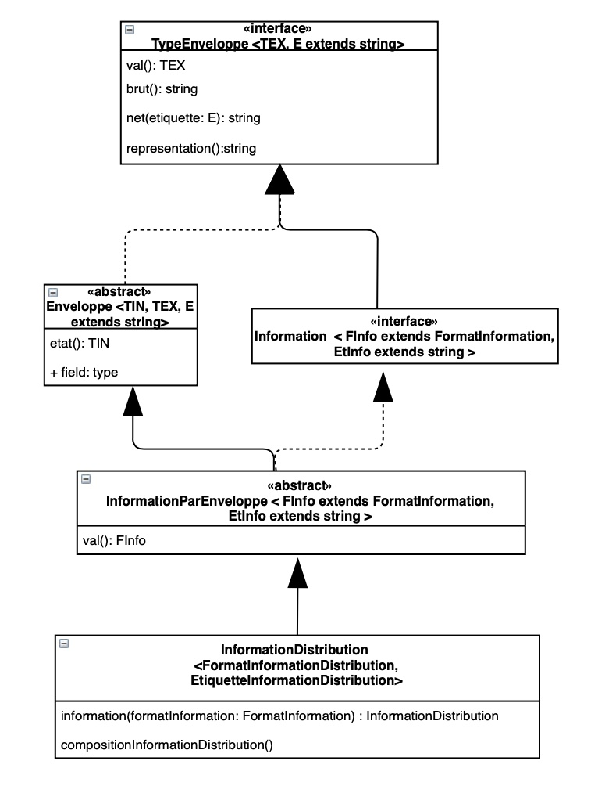

##Réseau Distribution

La communication est menée avec 4 types de messages différentes néanmoins, c'est possible d'additionner d'autres types de messages au protocole. Le format de ces types de messages deffini dans le fichier `echangesJeu1Distribution.ts`

### Types de messages :
1) Messages de configuration : Ce sont les premieres messages envoyés au client quand il se connecte. Ils contient l'information concernant a la connexion. Le domain du client, ses voisins, la consigne du jeu, le mot cible, etc.
2) Messages d'erreur : Ce sont les messages qui represented touts les erreurs qui peuvent avoir lieu pendant le jeu. Ces messages sont composés d'un type `(NOM_CONNEXIONS ou REDHIBITOIRE)`, puis du message d'erreur et finalement de la date ou l'erreur est produit
3) Messages d'information : Ce sont des messages qui informent aux clients sur l'État du jeu à un instant donné. Pour l'instant ces messages ne sont utilisés que pour communiquer le nombre de connexions dans le jeu au moment d'une nouvelle connexion ou apres d'une fermeture de connexion mais ils peuvent etre utilises pour d'autres finalites. Pour faire cela il faut juste ajouter un nouveau type. 
4) Messages de distribution : Ce sont les messages qui sont échangés pendant le jeu. Ils ont un type qui représente le type d'action du jeu  (verrouiller un message, diffuser quand le jeu a ete gagné ou perdu, diffuser des essais ou un utilisateur envoie le mot correspondent au domain ciblé, etc). Au même temps ces messages sont composees de l'identifiant de l'utilisateur que a envoyé le message, l'identifiant de son sommet, l'identifiant de l'utilisateur destin, son contenu (Qui doit être une sequence binaire), et la date.

### Envoyer des messages :

L'échange de messages et mène dans la classe  `serveursJeu1Distribution.ts` dans cette classe on peut trouver des fonctionnes qui envoient chaque type de message different à un utilisateur spécifique ou à plusieurs. Par example pour diffuser un message d'information à tous les clients connectés il faut d'abord créer le message d'information en utilisant la function `compositionInformationDistribution(msg: string, date: FormatDateFr, type: TypeInformationDistribution): InformationDistribution` puis, pour le diffuser il faut utiliser la function `diffuserInformation(info : InformationDistribution): void ` qui permet d'envoyer l'information à tous les clientes. 

### Ajouter un nouveau type de message : 

Dans le diagramme suivant on peut voir les classes associes au type de donné InformationDistribution. Cette composition est adaptée à tous les types de donnes du protocole de communication.

Pour ajouter un nouveau type de message il faut :
1) Ajouter dans la classe `formats.ts` l'interface qui représente l'enveloppe du nouveau type avec son format et ces étiquettes correspondantes. Pour le cas d'InformationDistribution cet interface s'appelle Information.
2) Dans la classe `formats.ts` créer la classe abstract du nouveau type qui define sa structure abstrait d'une structure JSON, cette classe doit hériter de la classe `Enveloppe` et implementer l'interface créée dans l'étape antérieure
3) Dans la classe `echangesJeu1Distribution.ts` créer l'interface qui représente le format du nouveau type de message. Pour `InformationDistribution` cette interface s'appelle `FormatInformationDistribution`
4) Créer la classe avec le nouveau type de message dans `echangesJeu1Distribution.ts` cette classe define la façon dont on crée ces messages avec le format pre-défini dans l'étape antérieure et permet sa composition pour que le message enveloppé puisse être envoyé dans le réseau.
5) Ajouter dans la classe `serveursJeu1Distribution.ts` les methods qui permettent soit d'envoyer le nouveau type de message à un client spécifique ou soit de le diffuser à tous les utilisateurs connectés dans le réseau. Pour InformationDistribution les methods utilisés pour ce fin sont `envoyerInformationAClient(
   info: InformationDistribution, idUtilisateur: Identifiant<"utilisateur">): boolean` et `diffuserInformation(info : InformationDistribution): void `
