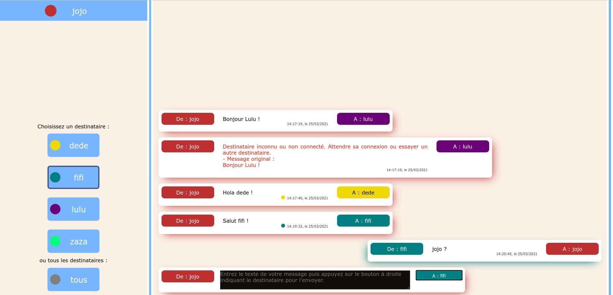

- connexion
- utilisation du jeu
  - tchat
  - jeu de distribution
- configuration

# Demande de code

Au moins TODO jours ouvrables avant la première connexion, l'enseignant doit **demander un code d'accès** à l'administrateur de l'application. TODO formulaire de contact.

L'enseignant fournit aussi des informations utiles lors de ce premier contact : 
- nombre d'élèves par classe,
- nombre de postes de travail,
- autorisation ou non du protocole [WebSocket](https://fr.wikipedia.org/wiki/WebSocket).

# Application en ligne

Les applications sont accessibles en ligne à l'adresse suivante :
- https://merite-communication.herokuapp.com
Leur utilisation suppose que le protocole WebSocket soit utilisable à partir des machines clientes (les postes de travail). Si ce n'est pas le cas, une installation locale est nécessaire.  

# TODO Installation locale

# Accès à l'application

Lors de la connexion à l'application, la page d'accueil demande le **code d'accès**. Une fois entré, envoyé et validé par le serveur, l'application présente le **menu principal**. 

# Menu principal

Le menu principal permet de choisir une des options suivantes :
- **Tchat en étoile**,
- **Tchat en anneau**,
- **Jeu de distribution**,
- **Administration**,
- **Retour** à la page de connexion, pour entrer un nouveau code d'accès.

# Tchat en étoile

L'application de tchat en étoile permet une discussion textuelle en ligne. Les discussions se font dans un réseau en étoile formé de cinq utilisateurs, de pseudos `dede`, ```fifi```, `jojo`, `lulu` et `zaza`. Le nombre de réseaux est configurable par connexion : par défaut, cinq réseaux sont disponibles, nommés `etoile0`, ..., `etoile4`. Les utilisateurs sont automatiquement affectés à un réseau lors de leur connexion à l'application de tchat : les réseaux sont complétés progressivement jusqu'au remplissage intégral.

Un réseau en étoile est un réseau complet : chaque utilisateur est relié à tous les autres utilisateurs. Deux modes de communication sont possibles : vers **un** utilisateur ou vers **tous** les utilisateurs.

TODO réseau en étoile

La fenêtre de l'application est divisée en deux colonnes : une colonne gauche indiquant le pseudo de l'utilisateur et ceux des autres membres du réseau, une colonne droite contenant les messages reçus et envoyés ainsi que le champ d'entrée des messages. La sélection du destinataire se fait dans la colonne de gauche : un destinataire parmi quatre possibles ou tous les destinataires possibles. 



L'affichage correspond à la suite suivante d'événements pour l'utilisateur de pseudo `jojo`.
- Envoi d'un message à `Lulu`. 
- Réception d'un message d'erreur : `lulu` n'est pas connectée.
- Envoi d'un message à `dede`, bien reçu comme l'indique la pastille jaune (couleur attribuée à `dede`) sous le corps du message.
- Envoi d'un message à `fifi`, bien reçu comme l'indique la pastille émeraude (couleur bleue/verte attribuée à `fifi`) sous le corps du message.
- Réception d'un message de `fifi`.

# Tchat en anneau

L'application de tchat en anneau permet une discussion textuelle en ligne. Les discussions se font dans un réseau en anneau formé de cinq utilisateurs, de pseudos `dede`, ```fifi```, `jojo`, `lulu` et `zaza`. Le nombre de réseaux est configurable par connexion : par défaut, cinq réseaux sont disponibles, nommés `anneau0`, ..., `anneau4`. Les utilisateurs sont automatiquement affectés à un réseau lors de leur connexion à l'application de tchat : les réseaux sont complétés progressivement jusqu'au remplissage intégral.

Un réseau en anneau n'est pas un réseau complet : chaque utilisateur n'est relié qu'à ses deux voisins. Deux modes de communication sont possibles : vers **un voisin** ou vers les **deux** voisins.

TODO réseau en anneau

La fenêtre de l'application est divisée en deux colonnes : une colonne gauche indiquant le pseudo de l'utilisateur et ceux des deux voisins, une colonne droite contenant les messages reçus et envoyés ainsi que le champ d'entrée des messages. La sélection du destinataire se fait dans la colonne de gauche : un destinataire parmi les deux possibles ou tous les destinataires possibles. 


L'affichage correspond à la suite suivante d'événements pour l'utilisateur de pseudo `dede`.
- Envoi du même message aux deux voisins `fifi` et `zaza`, bien reçu comme l'indique les pastilles colorées sous le corps du message. 
- Réception d'un message de `fifi`.
- Réception d'un message de `zaza`.

# Jeu de distribution

